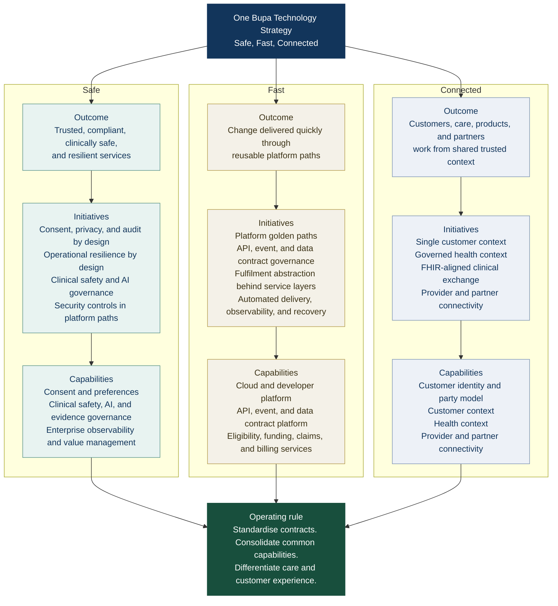

# Bupa IT Strategy: Safe, Fast, Connected Diagram

```mermaid
flowchart TB
    strategy["One Bupa Technology Strategy<br/>Safe, Fast, Connected"]
    rule["Operating rule<br/>Standardise contracts. Consolidate common capabilities.<br/>Differentiate care and customer experience."]

    strategy --> safeOutcome
    strategy --> fastOutcome
    strategy --> connectedOutcome

    subgraph safe["Safe"]
        direction TB
        safeOutcome["Outcome<br/>Trusted, compliant, clinically safe,<br/>and resilient services"]
        safeInitiatives["Initiatives<br/>Consent, privacy, and audit by design<br/>Operational resilience by design<br/>Clinical safety and AI governance<br/>Security controls in platform paths"]
        safeCapabilities["Capabilities<br/>Consent and preferences<br/>Clinical safety, AI, and evidence governance<br/>Enterprise observability and value management"]
        safeOutcome --> safeInitiatives --> safeCapabilities
    end

    subgraph fast["Fast"]
        direction TB
        fastOutcome["Outcome<br/>Change delivered quickly through<br/>reusable platform paths"]
        fastInitiatives["Initiatives<br/>Platform golden paths<br/>API, event, and data contract governance<br/>Fulfilment abstraction behind service layers<br/>Automated delivery, observability, and recovery"]
        fastCapabilities["Capabilities<br/>Cloud and developer platform<br/>API, event, and data contract platform<br/>Eligibility, funding, claims, and billing services"]
        fastOutcome --> fastInitiatives --> fastCapabilities
    end

    subgraph connected["Connected"]
        direction TB
        connectedOutcome["Outcome<br/>Customers, care, products, and partners<br/>work from shared trusted context"]
        connectedInitiatives["Initiatives<br/>Single customer context<br/>Governed health context<br/>FHIR-aligned clinical exchange<br/>Provider and partner connectivity"]
        connectedCapabilities["Capabilities<br/>Customer identity and party model<br/>Customer context<br/>Health context<br/>Provider and partner connectivity"]
        connectedOutcome --> connectedInitiatives --> connectedCapabilities
    end

    safeCapabilities --> rule
    fastCapabilities --> rule
    connectedCapabilities --> rule

    classDef strategy fill:#12355b,color:#ffffff,stroke:#12355b,stroke-width:2px
    classDef safe fill:#e8f3f1,color:#12355b,stroke:#5b948a,stroke-width:1px
    classDef fast fill:#f4f1e8,color:#3b3216,stroke:#b49b4d,stroke-width:1px
    classDef connected fill:#edf1f7,color:#12355b,stroke:#7c93b3,stroke-width:1px
    classDef rule fill:#184f3d,color:#ffffff,stroke:#184f3d,stroke-width:2px

    class strategy strategy
    class safeOutcome,safeInitiatives,safeCapabilities safe
    class fastOutcome,fastInitiatives,fastCapabilities fast
    class connectedOutcome,connectedInitiatives,connectedCapabilities connected
    class rule rule
```
