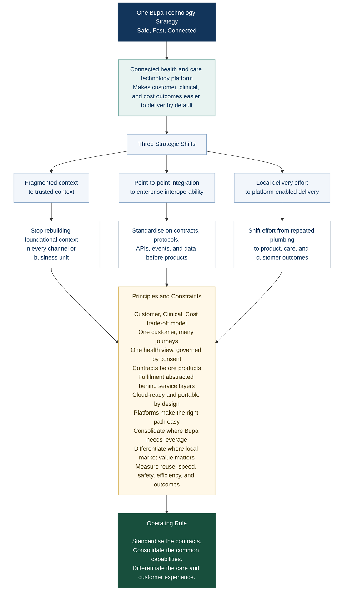

# Bupa IT Strategy Single Diagram

```mermaid
flowchart TB
    ambition["One Bupa Technology Strategy<br/>Safe, Fast, Connected"]
    proposition["Connected health and care technology platform<br/>Makes customer, clinical, and cost outcomes easier to deliver by default"]

    ambition --> proposition

    proposition --> shifts["Three Strategic Shifts"]

    shifts --> shift1["Fragmented context<br/>to trusted context"]
    shifts --> shift2["Point-to-point integration<br/>to enterprise interoperability"]
    shifts --> shift3["Local delivery effort<br/>to platform-enabled delivery"]

    shift1 --> decision1["Stop rebuilding foundational context<br/>in every channel or business unit"]
    shift2 --> decision2["Standardise on contracts, protocols,<br/>APIs, events, and data before products"]
    shift3 --> decision3["Shift effort from repeated plumbing<br/>to product, care, and customer outcomes"]

    decision1 --> principles["Principles and Constraints<br/><br/>Customer, Clinical, Cost trade-off model<br/>One customer, many journeys<br/>One health view, governed by consent<br/>Contracts before products<br/>Fulfilment abstracted behind service layers<br/>Cloud-ready and portable by design<br/>Platforms make the right path easy<br/>Consolidate where Bupa needs leverage<br/>Differentiate where local market value matters<br/>Measure reuse, speed, safety, efficiency, and outcomes"]
    decision2 --> principles
    decision3 --> principles

    principles --> operatingRule["Operating Rule<br/><br/>Standardise the contracts.<br/>Consolidate the common capabilities.<br/>Differentiate the care and customer experience."]

    classDef title fill:#12355b,color:#ffffff,stroke:#12355b,stroke-width:2px
    classDef core fill:#e8f3f1,color:#12355b,stroke:#6aa59b,stroke-width:1px
    classDef shift fill:#f2f6fb,color:#12355b,stroke:#8aa7c7,stroke-width:1px
    classDef decision fill:#ffffff,color:#12355b,stroke:#c3ccd6,stroke-width:1px
    classDef principle fill:#fff8e8,color:#3e2f00,stroke:#d7b45a,stroke-width:1px
    classDef final fill:#184f3d,color:#ffffff,stroke:#184f3d,stroke-width:2px

    class ambition title
    class proposition core
    class shifts,shift1,shift2,shift3 shift
    class decision1,decision2,decision3 decision
    class principles principle
    class operatingRule final
```
